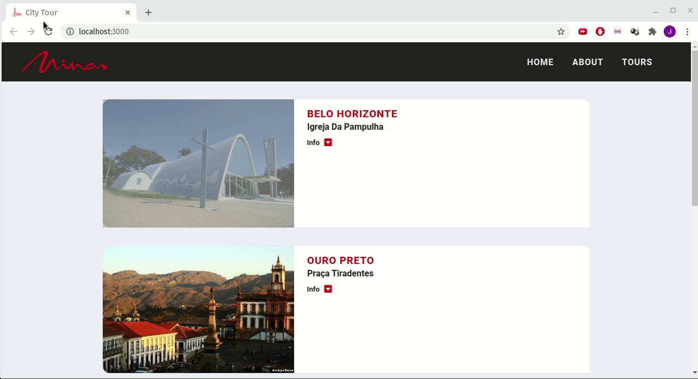

# City Tour

> This project was made using **React**, **HTML**, **CSS** and **JavaScript-Vanilla**. The objective was to understand and improve my skills using these tools.

## How to Run this Project

- git clone "https://github.com/joaorpereira/city-tour.git"
- npm install
- npm start

## Versions

- node: v12.18.3

## License

- **[MIT license](http://opensource.org/licenses/mit-license.php)**
